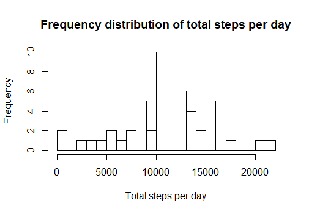
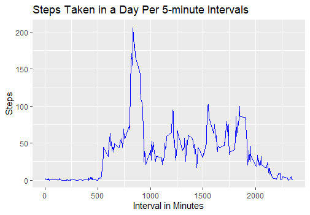
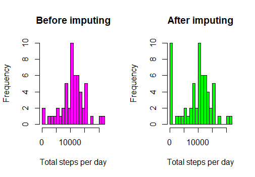
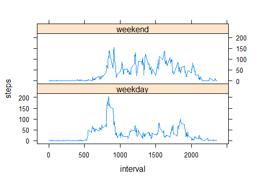

## Reading the data
This code chunk shows how the data is read into R:
```{r}
activity <- read.csv(file = "activity.csv")
```


## What is mean total number of steps taken per day?
The total number, mean, and median, of steps taken per day are as follows:

### Total steps per day
```{r, results = TRUE}
as.data.frame(tapply(activity$steps, activity$date, sum))
```
### Mean steps per day
```{r}
as.data.frame(tapply(activity$steps, activity$date, mean))
```
### Median steps per day
```{r}
as.data.frame(tapply(activity$steps, activity$date, median))
```
### Histogram of total steps taken per day

 

```{r}
total <- tapply(activity$steps, activity$date, sum)
total <- as.numeric(total) # change to numeric vector
hist(total, xlab = "Total steps per day", main = "Frequency distribution of total steps per day", breaks = 30)
```

## What is the average daily activity pattern?
The following code shows how the data is set up to achieve the plot below, showing a time series plot of average steps taken in a day at 5-minute intervals. 
```{r}
library(ggplot2)

interval_steps <- as.data.frame(tapply(activity$steps, activity$interval, mean, na.rm = TRUE))
interval <- row.names(interval_steps)
is <- cbind(interval, interval_steps)
colnames(is) <- c("interval", "steps")
is$interval <- as.character(is$interval); is$interval <- as.numeric(is$interval) # convert character then numeric to avoid factor variable being converted into 1, 2, 3.... 
str(is) # check that format is correct in 'is', the dataframe for plotting
```
Below is a time series plot of steps taken at 5-minute intervals throughout a day, averaged across all days in the dataset. Each day has 288 intervals.
 

```{r}
ggplot(data = is, aes(x = interval, y = steps)) + geom_line(col = "blue") + labs(title = "Steps Taken in a Day Per 5-minute Intervals", x = "Interval in Minutes", y = "Steps")
```


To answer the question: **Which 5-minute interval, on average across all the days in the dataset, contains the maximum number of steps?**, we can use the following code to find that the answer is **interval 835** with roughly **206** steps. This also corresponds to the above plot.
```{r}
library(dplyr)
head(arrange(is, desc(steps)), 1)
```

## Imputing missing values?
The total number of rows with missing values are 2304:
```{r}
sum(is.na(activity))
```
I will fill in the missing numbers using **fill** from the **tidyr** package. NA values are filled in with the nearest existing value *below*. This data is saved in **new_act**. 
```{r}
library(tidyr)
new_act <- activity %>% fill(steps, .direction = "updown")
```
We can check to see that all missing cases are filled in. The first line of code tells us there are **17568** rows in this dataset and the second line tells us that indeed, these rows are all complete. 
```{r}
dim(new_act)
length(complete.cases(new_act))
```
Below, I address the following section of the assignment: **Make a histogram of the total number of steps taken each day and calculate and report the mean and median total number of steps taken per day. Do these values differ from the estimates from the first part of the assignment? What is the impact of imputing missing data on the estimates of the total daily number of steps**
```{r}
total2 <- tapply(new_act$steps, new_act$date, sum)
total2 <- as.numeric(total2) 
par(mfrow = c(1, 2))
hist(total, xlab = "Total steps per day", main = "Before imputing", breaks = 30, col = "magenta")
hist(total2, xlab = "Total steps per day", main = "After imputing", breaks = 30, col = "green")
```
 


The above histogram shows that there isn't very much change between the historgams before versus after imputing the values other than that the frequency of 0s increased a lot, due to the method of imputation used.

Looking at the mean and median number of steps taken before and after imputation, we can see that the mean dramatically decreases after imputation due to the increased number of 0s. The median has decreased as well, though less dramatically. 
```{r}
summary(total2) # after imputing
summary(total) # before imputing

```


## Are there differences in activity patterns between weekdays and weekends?
Below is the code for sorting the data to create the plot comparing weekend and weekday activity. As can be seen, people tend to be less active during weekends, and tend to stay inactive until later on in the day.

 


```{r}
library(lubridate)

new_act$date <- mdy(new_act$date)
weekdays <- weekdays(new_act$date)
new_act <- cbind(new_act, weekdays)
new_act$weekdays <- as.character(new_act$weekdays) # convert to character to use gsub

# categorize as 'weekday' or 'weekend'
new_act$weekdays <- gsub("Monday", "weekday", new_act$weekdays)
new_act$weekdays <- gsub("Tuesday", "weekday", new_act$weekdays)
new_act$weekdays <- gsub("Wednesday", "weekday", new_act$weekdays)
new_act$weekdays <- gsub("Thursday", "weekday", new_act$weekdays)
new_act$weekdays <- gsub("Friday", "weekday", new_act$weekdays)
new_act$weekdays <- gsub("Saturday", "weekend", new_act$weekdays)
new_act$weekdays <- gsub("Sunday", "weekend", new_act$weekdays)

# split
wdays <- filter(new_act, weekdays == "weekday")
wends <- filter(new_act, weekdays == "weekend")

# apply
weekday <- tapply(wdays$steps, wdays$interval, mean)
weekend <- tapply(wends$steps, wends$interval, mean)

# combine
interval <- unique(new_act$interval)

week_data <- cbind(interval, weekday, weekend); week_data <- as.data.frame(week_data)

# reshape the data
wk <- gather(week_data, week, steps, weekday:weekend)

# make plot
library(lattice)
xyplot(steps ~ interval | week, data = wk, layout = c(1,2), type = "l")
```

